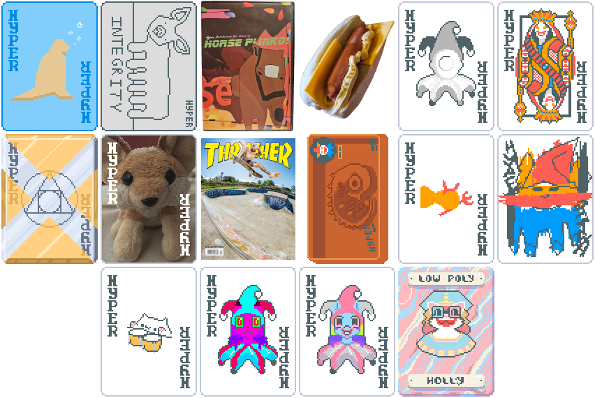

# Hyper Definition Balatro Mod

Made for a group of friends and content creators. There are 16 jokers in this mod, each with a unique ability. Have fun!

## Requirements for v0.5.0
- Balatro 1.0.1o or later
- **[Lovely v0.6.0](https://github.com/ethangreen-dev/lovely-injector)** or later
- **[Steamodded 1.0.0~BETA-0305c](https://github.com/Steamodded/smods/releases)** or later

## Installation
1. Follow the instructions for installing **[Lovely](https://github.com/ethangreen-dev/lovely-injector)** and **[Steamodded](https://github.com/Steamodded/smods/wiki)**.
2. Download the latest release or source code.
3. Extract `hyperdef-balatro` to the `Mods` folder.
**Windows:** `%AppData%/Balatro/Mods`;
**Mac:** `~/Library/Application Support/Balatro/Mods`;
**Linux (WINE/Proton):** `~/.local/share/Steam/steamapps/compatdata/2379780/pfx/drive_c/users/steamuser/AppData/Roaming/Balatro/Mods`;

## Jokers
|Joker|Rarity|Ability|
|-----|------|-------|
|Wooden Kaiju|Common|+4 Mult per hand played this round|
|Shop-Corp Poster|Common|This Joker gains +3 Mult when a card from your deck is destroyed|
|Horse Plinko|Common|2 in 7 chance to give +1 Chips, 2 in 7 chance to give +50 Chips, 2 in 7 chance to give +100 Chips, 1 in 7 chance to give +250 Chips (Chances cannot be modified)|
|Stead Dog|Common|Start round with 35% of required chips, -7% per round|
|Buffer Joker|Common|Every 6 hands, give +1 hands this round and debuff played hand|
|Polyqueen|Uncommon|Retrigger all Queens if at least 3 Queens are held or played|
|Alchemy|Uncommon|Gold and Steel cards share abilities|
|Hydra the Fox|Uncommon|+100 Chips, when round begins, draw a card from your deck and destroy it|
|Magazine Subscription|Uncommon|When Blind is selected, spend $3 and create a Spectral card (Must have room)|
|Adam|Rare|After 12 rounds, sell this card to create a Legendary Joker|
|Fish Satan|Rare|X3 Mult if played hand has a scoring 6|
|Manic Scribbles|Rare|Randomly change rank and suit of each card in first discard of round|
|Oxoboo|Rare|Create a Negative Tarot card if Blind is defeated on the first hand of round|
|Creature|Rare|Each Enhanced card gives X1.75 Mult when scored|
|Stead|Rare|Sell this card for $0 to Duplicate Joker to its right|
|Low Poly Holly|Legendary|If played hand has only 1 card, all face cards held in hand are converted into that card|

## Decks
|Deck|Description|
|----|-----------|
|Hyper Deck|First shop has Hyper Packs|

## Boosters
|Booster|Description|
|-------|-----------|
|Hyper Pack 1|Choose 1 of 7 Hyper Definition Joker cards (Only in Hyper Deck)|
|Hyper Pack 2|Choose 1 of 8 Hyper Definition Joker cards (Only in Hyper Deck)|
